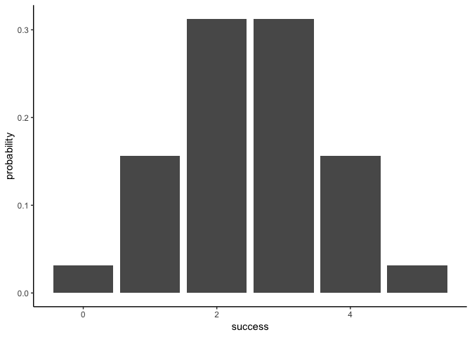
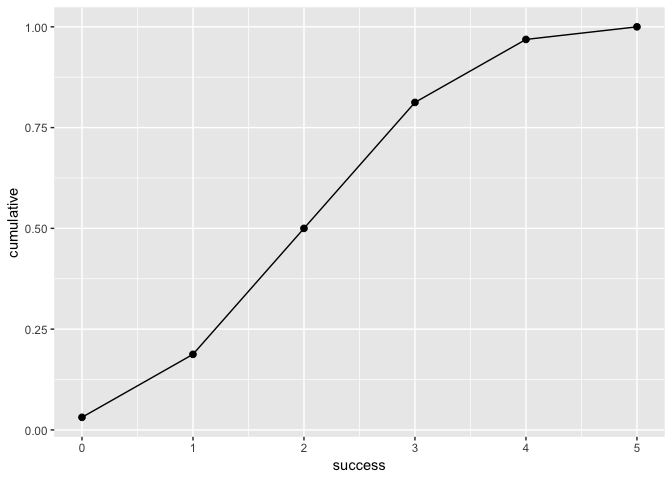

Overview
--------

"binomial" is a package that provides functions to calculate the binomial probability distribution functions

-   `bin_choose` a function that computes the number of successes can occur in given trials
-   `bin_probability` a function that computes the probability of getting a particular number of successes in given trials.
-   `bin_distribution` a function that computes the probability distribution.
-   `bin_cumulative` a function that computes the cumulative distribution.
-   `bin_variable` creates a binomial random variable object (of class '"binvar"')
-   `plot()` a method to display a histrogram of the `bin_distribution` and the cumulative probability of `bin_cumulative`
-   `print()` a method to display a data frame of the object of class `binvar`
-   `summary()` a method to display all the measures of the object of class `binvar`
-   `print.summary()` a method to display a data frame of the `summary()`

Motivation
----------

This package is to provide binomial probability distribution functions that illustrates binomial concepts.

Installation
------------

Install the development version from GitHub via the package `"devtools"`:

``` r


# development version from GitHub:
#install.packages("devtools") 
# install "binomial" (without vignettes)

devtools::install_github("anthony-repo/binomial/binomial")
#> Skipping install of 'binomial' from a github remote, the SHA1 (163405c7) has not changed since last install.
#>   Use `force = TRUE` to force installation
# install "binomial" (with vignettes)
devtools::install_github("anthony-repo/binomial/binomial", build_vignettes = TRUE)
#> Skipping install of 'binomial' from a github remote, the SHA1 (163405c7) has not changed since last install.
#>   Use `force = TRUE` to force installation
```

Usage
-----

``` r

library(binomial)
library(ggplot2)

# the number of combinations to choose 2 objects from 5 objects
bin_choose(n = 5, k = 2)
#> [1] 10

# the probability of getting 2 successes out of 5 trials
bin_probability(success = 2, trials = 5, prob = 0.5)
#> [1] 0.3125

# probability distribution and its barplot
dis1 <- bin_distribution(trials = 5, prob = 0.5)
dis1
#>   success probability
#> 1       0     0.03125
#> 2       1     0.15625
#> 3       2     0.31250
#> 4       3     0.31250
#> 5       4     0.15625
#> 6       5     0.03125
plot(dis1)
#> Warning: Ignoring unknown parameters: binwidth, bins, pad
```



``` r

# probability distribution and the cumulative probability along with its graph
dis2 <- bin_cumulative(trials = 5, prob = 0.5)
dis2
#>   success probability cumulative
#> 1       0     0.03125    0.03125
#> 2       1     0.15625    0.18750
#> 3       2     0.31250    0.50000
#> 4       3     0.31250    0.81250
#> 5       4     0.15625    0.96875
#> 6       5     0.03125    1.00000
plot(dis2)
```



``` r

# creates a binomial random variable and displays its summary
bin1 <- bin_variable(trials = 10, p = 0.3)
bin1
#> "Binomial variable"
#> 
#> Parameters
#> - number of trials: 10
#> - prob of success : 0.3
binsum1 <- summary(bin1)
binsum1
#> "Summary Binomial"
#> 
#> Parameters
#> - number of trials: 10
#> - prob of success : 0.3
#> 
#> Measures
#> - mean    : 3
#> - variance: 2.1
#> - mode    : 3
#> - skewness: 0.276026223736942
#> - kurtosis: -0.123809523809524
```
